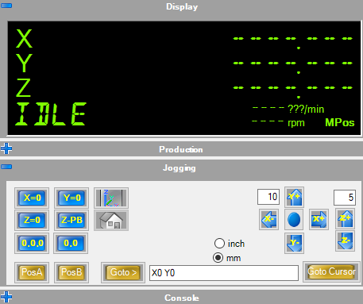

This is a slightly modified version of the GRBLMachinePlugin (based on the v1.0.0 source code posted in the CamBam forum):

## Features
* Jogging: Support for Z-Probe
* Jogging: Support for "go to mouse click"
* Jogging: Support for keyboard shortcuts

* Minor bugfixes in the existing GRBLMachine code

## Download
Download the latest plugin on the [Releases](https://github.com/thekroko/GRBLMachinePlugin/releases) page.

## Changelog

[1.0.0b]
+ Changed Z-Probe gcode to always reset WCS zero to Z-probe height, resulting
  in a more reliable Z-Probe.
+ Reset GRLB input gcode file when the opened CamBam file changes (to prevent
  accidentally using the previous file)

[1.0.0a]
+ Added draggable "MouseJog" button for easier jogging
+ Added keyboard arrow shortcuts for jogging
+ Add button for Z-Probe (with user-specified tool offset setting)
+ Add button to move router to a point in the drawing selected by mouse
+ Disabled "Reset your WCS origin?" dialog